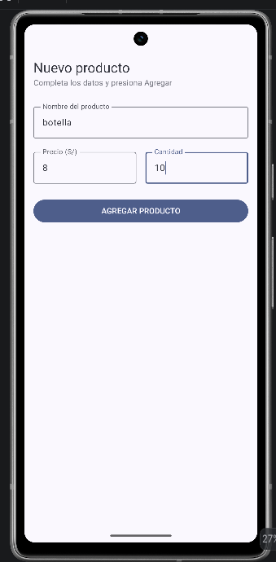
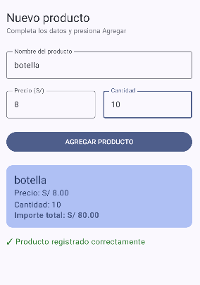

# Laboratorio 03 - Registro de Producto con Jetpack Compose
**Estudiante:** Israel Huaman H.
## Descripción
Este es un proyecto de laboratorio para practicar la creación de interfaces de usuario utilizando Jetpack Compose. Implementa un formulario de registro de producto con los campos Nombre, Precio y Cantidad, manejando el estado de la UI (con `remember` y `mutableStateOf`) y mostrando una tarjeta de resumen al presionar el botón de agregar.
## Capturas de Pantalla
**Pantalla Vacía:**

**Producto Registrado:**

## Pregunta del Laboratorio
**¿Qué pasaría si declaras las variables de los campos SIN `remember`?**
Si se declaran las variables usando `mutableStateOf` pero sin envolverlas en `remember`, el estado no "sobreviviría" a las recomposiciones. Cada vez que el usuario ingresa un carácter en el `OutlinedTextField`, Compose vuelve a ejecutar la función (recomposición). Sin `remember`, la variable de estado se reinicializaría nuevamente a su valor por defecto (como `""`), y por lo tanto, el campo de texto se blanquearía y no permitiría escribir correctamente. `remember` le dice a Compose que recuerde el valor en la memoria a través de las recomposiciones.
